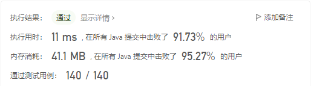
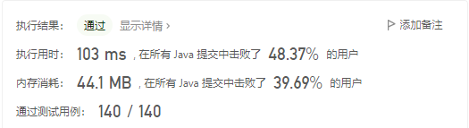

# 中心扩张法



### 注意：

1. 注意出现“aaaa”、“aaa”这样相同字符的回文子串，因此需要在第一个while循环中判断从当前i开始左右是否相同。

2. 在完成相同字符的判断后，进行left-1和right+1同时判断，查找回文数。

3. 时间复杂度：O(n^2)

   空间复杂度：O(1)

   时间换空间

### 替换：

1. 将字符串转为数组的方式有：

   ```java
   char[] str = s.toCharArray();
   ```

2. 提取字符串中某一下标的字符：

   ```java
   char st = s.charAt(3);
   ```

   

# 动态规划



二维数组是动态规划最常用的方法

### 注意:

1. 此方法核心在于按照子串长度进行遍历，判断l长度的子串是否为回文子串，即判断除去两个端点的子串是否为回文子串

2. 1中至少要有三个元素。在只有1个元素时，回文子串就是它自己；有两个元素时，如果两个元素相等则为回文子串。

3. 时间复杂度：O(n^2)

   空间复杂度：O(n^2)


