# 1、两数之和

## length的使用

1. `length`

   length是属性，是**数组**的长度，使用时的形式是：数组`.length`不加括号

2. `length()`

   length()是**字符串**自带的方法，是求字符串长度的，使用形式是：`str.length()`

3. `size()`

   size()是**列表**的自带方法，求的是列表的长度，使用形式是：`list.size()`


2

3

# 4、寻找两个正序数组的中位数

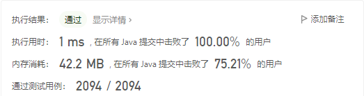


# 5、最长回文子串

## 中心扩张法

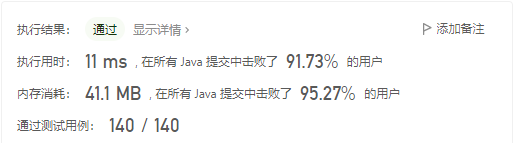

### 注意

1. 注意出现“aaaa”、“aaa”这样相同字符的回文子串，因此需要在第一个while循环中判断从当前i开始左右是否相同。

2. 在完成相同字符的判断后，进行left-1和right+1同时判断，查找回文数。

3. 时间复杂度：O(n^2)

   空间复杂度：O(1)

   时间换空间

### 替换

1. 将字符串转为数组的方式有：

   ```java
   char[] str = s.toCharArray();
   ```

2. 提取字符串中某一下标的字符：

   ```java
   char st = s.charAt(3);
   ```


## 动态规划

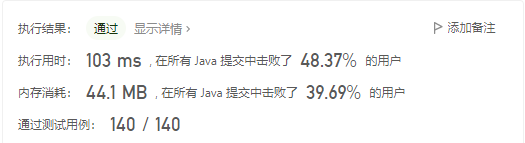

二维数组是动态规划最常用的方法

### 注意

1. 此方法核心在于按照子串长度进行遍历，判断l长度的子串是否为回文子串，即判断除去两个端点的子串是否为回文子串

2. 1中至少要有三个元素。在只有1个元素时，回文子串就是它自己；有两个元素时，如果两个元素相等则为回文子串。

3. 时间复杂度：O(n^2)

   空间复杂度：O(n^2)


# 11、盛最多水的容器

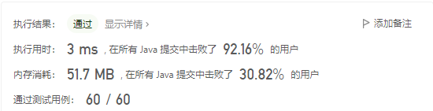

逻辑性很强的题目！！

双指针，一个指向最左边，一个指向最右边，这两个指针所指的相对长的板后面称为长板，相对短的板称为短板。

对于左右指针逼近，容器的底边长度一定是在减小。

容器的盛水量取决于底边长度和**短板**。

所以！如果移动短板，可能会遇到更短或者相等的板，那是不幸，容量变小；如果遇到长一些的板子，容量可能变小也可能不变也可能变大。

如果移动长板，底边长度一定减小，如果遇到的是长板，因为容器的高取决于短板，且底边变短，所以容量一定减小；如果遇到比自己短，比短板长的板子，和刚刚一样的道理，也是容量变小；如果遇到比短板还短的板子，那更不用说了，短边变成它自己了，容量一定减小。

因此！富贵险中求！如果移动长板，那容量是一定减少的！如果移动短板，有几率容量变大！

所以设置一个max值，每次移动都记录一下容量，当i与j相遇就说明遍历结束，最后返回max即可。


# 15、三数之和

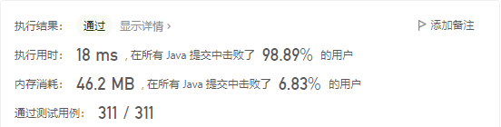

1. List<List<Integer>> 的定义

   ```java
   List<List<Integer>> result = new ArrayList<List<Integer>>();
   ```

2. List<Integer>的定义

   ```java
   List<Integer> r = new ArrayList<Integer>();
   ```

3. List的添加操作

   ```java
   list1.add(r);    //r必须是list的<>内的类型，在尾部插入
   ```

4. List的搜索操作

   ```java
   list1.get(index);    //获取list下标为index的数值
   ```

5. int转为Integer

   ```java
   int a;
   Integer b = Integer.valueOf(a);
   ```

6. 数组的排序

   ```java
   Arrays.sort(nums);     //原地修改nums数组
   ```


# 26、删除有序数组中的重复项

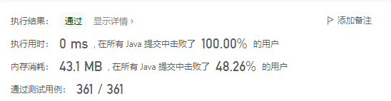

双指针思路


# 68、文本左右对齐

## 方法一、枚举各种情况

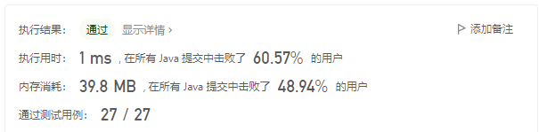

`_1.java`文件为精简版（将很多重复的代码放入函数）

`_2.java`文件更容易理解

`_3.java`文件思路一致，但是更加精简，且易懂⭐

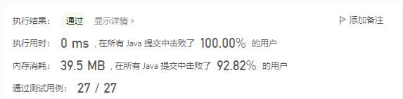


# 135、分发糖果

## 方法一、递归

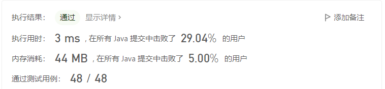

思想：相邻的两个值中，更大的糖果=更小的糖果+1，如果比左右都大则取其max。如果比左右都小，则糖果数为1。用数组记录数值，可以提高时间效率（如果不设置数组，则会超时）。

## 方法二、左右遍历

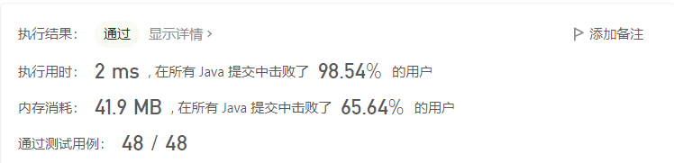

思想：从左向右遍历一遍，设置第一个值为1，如果当前值比上一个值大，则糖果数=上一个的糖果数+1，反之将其置为1。此时从左到右的糖果大小关系已经明确。再从右往左遍历一遍，此时只需要一个temp变量记录即可，设置第一个的temp为1，如果当前值比上一个值大，则糖果数=temp+1，对于每一个小朋友都会对他从左遍历和从右遍历取最大值，也就是他最后得到的糖果值。

> 对于 `[1,2,87,87,87,2,1]`
>
> 从左向右：1，2，3，1，1，1，1
>
> 从右向左：1，1，1，1，3，2，1
>
> 综合：1，2，3，1，3，2，1


# 707、设计链表

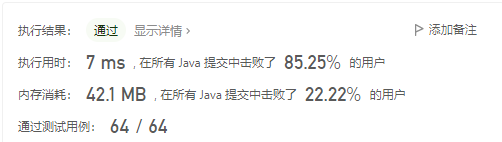

Java语言使用链表格式：

```java
class MyLinkedList {
    static class Node {
        int val;
        Node pre;
        Node next;
        public Node() {
        }
        public Node(int val) {
            this.val = val;
        }
    }

    Node head;
    int size=0;

    public MyLinkedList() {
        head = new Node();
        head.next = head;
        head.pre = head;
    }
    
    public int get(int index) {
        Node node = head;
        //......
    }
    //......
}

//调用
MyLinkedList linkedList = new MyLinkedList();
linkedList.get(1);    
```


# 788、旋转数字

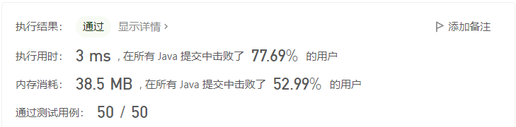


# 1640、能否连接形成数组

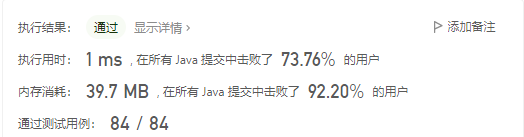


# 1652、拆炸弹

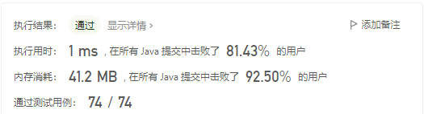

负数的求余：

被除数的绝对值与除数绝对值取余的值即为余数绝对值，余数符号与被除数一致。


# 面试题 01.02. 判定是否互为字符重排⭐

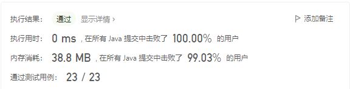

本题可以使用将字符串转为字符数组：

```java
char[] sa1 = s1.toCharArray();
```

再对字符数组进行排序，一样可以使用Arrays.sort()：

```java
Arrays.sort(sa1);     //对sa1原地排序
```

判断两个字符数组是否相同，可以先将字符数组转为字符串：

```java
String s = String.valueOf(sa1);
```

字符串的比较：

```java
s1.equals(s2);    //返回true或者false
```


# 面试题17.09.第k个数

## 方法一、硬算

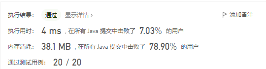

使用方法三的手法进行优化

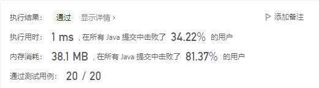

List本质上就是动态数组

创建：

```java
List<Integer> list = new ArrayList<Integer>();
```

添加：

```java
list.add(16);
```

查询：

```java
list.get(0);     // 通过下标查询
```

## 方法二、小根堆

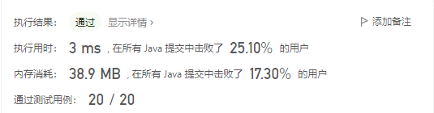

### 小根堆

小根堆的创建：

```java
PriorityQueue<Long> q = new PriorityQueue<>();
```

小根堆添加操作：

```java
q.add(5);
```

小根堆判断是否为空：

```java
q.isEmpty()    //如果是空则返回true
```

小根堆弹出操作（弹出最小的数，并返回此数）：

```java
long t = q.poll();
```

### Set集合

Set 表示唯一对象的集合。集合中元素的排序是不相关的。

#### HashSet

HashSet 基于 HashMap 来实现的，是一个**不允许有重复元素的集合**。

HashSet 允许有 null 值。

HashSet **是无序的，即不会记录插入的顺序**。

HashSet 实现了 Set 接口。（这就是为什么这个解法可以使用`Set<Long> set = new HashSet<>();`）

Set对象的创建：

```
Set<Long> set = new HashSet<>();
```

Set对象的添加操作：

```java
set.add(6);
```

Set对象的判断是否存在操作：

```java
set.contains(k)     //判断k这个值在set中是否存在，存在则返回true
```

## 方法三、多路归并（多指针）（方法一优化）


设置3个指针，分别是对于\*3、\*5、*7的，每次比较选择最小的加入到数组中。

### 注意

在使用两个数比大小时，尽量使用`Math.min(a,b)`。如果时三个数，使用`Math.min(a,Math.min(b,c))`。


# 面试题 17.19、消失的两个数字

## 方法一、硬算（不合规矩）

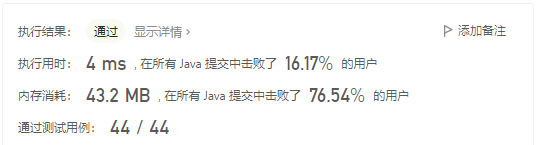

## 方法二、异或（官方）

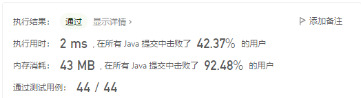

> 1. **负数的补码:**
>
>    对于正数9：0000 1001
>
>    对于负数-9：先-1：0000 1000；再全部取反：1111 0111。
>
> ​										或者先变成：1000 1001；再除了符号位取反：1111 0110；再末位+1：1111 0111。
>
> ​			所以:  9 = 0000 1001
>
> ​						-9 = 1111 0111
>
>    			9 & -9 = 0000 0001（能生成二进制中为1的最小位） 
>
> ​			拓展:  10 = 0000 1010
>
> ​          			-10 = 1111 0110
>
>  			 10 & -10 = 0000 0010 
>
> 2. **异或**
>
>    Java中异或用`^`表示
>
>    1 ^ 1 ^ 2 ^ 2 ^ 3 ^ 4 => 0 ^ 0 ^ 3 ^ 4 => 0 ^ 3 ^ 4（x = 3^4）=> 0 ^ x => x
>
>    即 a ^ a ^ b = b
>
> 3. `Integer.MIN_VALUE` = 1000 0000 0000 0000 0000 0000 0000 0000，-2 147 483 648
>
>    `Integer.MIN_VALUE` = 0111 1111 1111 1111 1111 1111 1111 1111， 2 147 483 647

逻辑：

这是考察异或和且的位运算算法题。我们想要找到n个数中没有出现的2个数，也就是再n个数中找出除了`nums`中存在的n-2个数的另外2个数。

如果先将这n个数和`nums`中n-2个数异或，也就是这2n-2（n-2 + n-2 + 2）个数异或，根据上面异或的相关知识，能得到结果`x = x1 ^ x2`（x为异或结果，x1、x2为我们想要求得的两个不在nums的数）。

得到`x = x1 ^ x2`，如何提取出x1和x2成为了最大的难题。我们发现x1和x2不可能相同，所以`x1&x2! = 0`，根据上面且的相关知识，对于x而言，它二进制最低位的1（假设是第k位）所代表的含义是x1的第k位和x2的第k位是不相同的（因为相同为0、不同为1），因此我们可以将`nums`分为两类，一类是第k位为0的，一类是第k位为1的。筛选出`nums`这两类很简单，只需要与`x&-x`（`x&-x`的结果是除了第k位为1，其他位都是0）进行且操作，如果结果是0，表示`nums`中的这个数的第k位是0；如果是1，表示`nums`中的这个数的第k位是1。这里需要进行防溢出操作，即判断`x == Integer.MIN_VALUE`，如果成立，说明-x已经越界，就直接将x与nums中每个数进行比较筛选。

经过上一步就已经将`nums`分为两部分了`type1`、`type2`，这时候只需要将n个数分为两部分，两部分分别是`type1`多一个x1、`type2`多一个x2。只需要再用一次异或，结果就分别是x1和x2了。

返回结果直接用`new int[]{type1,type2}`即可。

## 方法三、求和

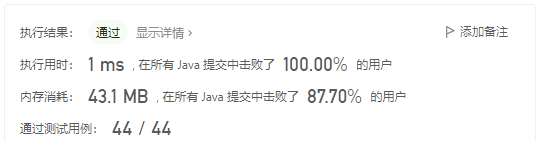

本方法使用数学基础运算。先求出n个数之和，再求出nums中n-2个数之和，则这两个和之差就是`x1+x2`。我们可以通过`x = x1+x2`，算出x1和x2的中位数t，即**x1一定小于t，x2一定大于t**，求出1~t的和truenum，可以将nums遍历一遍，筛选每一个值小于等于t的num，再用truenum减去这个值，得到的结果就是x1。用`x2 = x - x1`得到结果。
