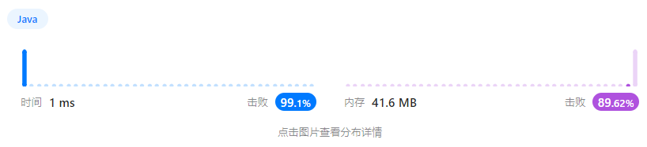
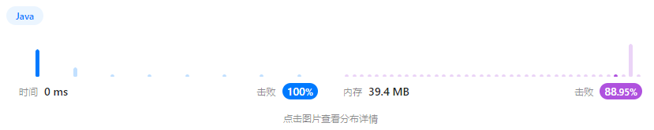
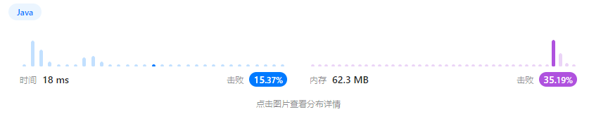
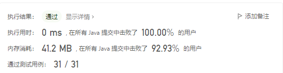
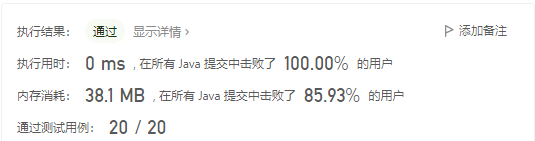

# 1、两数之和

### length的使用

1. `length`

   length是属性，是**数组**的长度，使用时的形式是：数组`.length`不加括号

   例如：

   ```java
   String[] cp;
   int n = cpdomains.length;
   ```

2. `length()`

   length()是**字符串**自带的方法，是求字符串长度的，使用形式是：`str.length()`

3. `size()`

   size()是**列表**的自带方法，求的是列表的长度，使用形式是：`list.size()`


# 4、寻找两个正序数组的中位数


# 5、最长回文子串

## 方法一、中心扩张法


### 注意

1. 注意出现“aaaa”、“aaa”这样相同字符的回文子串，因此需要在第一个while循环中判断从当前i开始左右是否相同。

2. 在完成相同字符的判断后，进行left-1和right+1同时判断，查找回文数。

3. 时间复杂度：O(n^2)

   空间复杂度：O(1)

   时间换空间

### 替换

1. 将字符串转为数组的方式有：

   ```java
   char[] str = s.toCharArray();
   ```

2. 提取字符串中某一下标的字符：

   ```java
   char st = s.charAt(3);
   ```

## 方法二、动态规划


二维数组是动态规划最常用的方法

### 注意

1. 此方法核心在于按照子串长度进行遍历，判断l长度的子串是否为回文子串，即判断除去两个端点的子串是否为回文子串

2. 1中至少要有三个元素。在只有1个元素时，回文子串就是它自己；有两个元素时，如果两个元素相等则为回文子串。

3. 时间复杂度：O(n^2)

   空间复杂度：O(n^2)


# 11、盛最多水的容器


逻辑性很强的题目！！

双指针，一个指向最左边，一个指向最右边，这两个指针所指的相对长的板后面称为长板，相对短的板称为短板。

对于左右指针逼近，容器的底边长度一定是在减小。

容器的盛水量取决于底边长度和**短板**。

所以！如果移动短板，可能会遇到更短或者相等的板，那是不幸，容量变小；如果遇到长一些的板子，容量可能变小也可能不变也可能变大。

如果移动长板，底边长度一定减小，如果遇到的是长板，因为容器的高取决于短板，且底边变短，所以容量一定减小；如果遇到比自己短，比短板长的板子，和刚刚一样的道理，也是容量变小；如果遇到比短板还短的板子，那更不用说了，短边变成它自己了，容量一定减小。

因此！富贵险中求！如果移动长板，那容量是一定减少的！如果移动短板，有几率容量变大！

所以设置一个max值，每次移动都记录一下容量，当i与j相遇就说明遍历结束，最后返回max即可。


# 15、三数之和


1. List<List<Integer>> 的定义

   ```java
   List<List<Integer>> result = new ArrayList<List<Integer>>();
   ```

2. List<Integer>的定义

   ```java
   List<Integer> r = new ArrayList<Integer>();
   ```

3. List的添加操作

   ```java
   list1.add(r);    //r必须是list的<>内的类型，在尾部插入
   ```

4. List的搜索操作

   ```java
   list1.get(index);    //获取list下标为index的数值
   ```

5. List查找某个元素是否在其中

   ```java
   list.contains(s);    //查找s这个元素是否在list中
   ```

6. int转为Integer

   ```java
   int a;
   Integer b = Integer.valueOf(a);
   ```

7. 数组的排序

   ```java
   Arrays.sort(nums);     //原地修改nums数组
   ```


# 26、删除有序数组中的重复项


双指针思路


# 31、下一个排列


思路很强，考验找规律的能力。

例：

**对于 123465：**

第一步，从后往前找到第一对升序的两个数，也就是46

第二步，从结尾开始到6，**找到第一个大于4的数**，也就是5

第三步，将4和5对换位置，变成123564

第四步，将6开始到结尾变成升序，变成123546

**简化：**

第一步，从后往前找到第一对升序的两个数，也就是46

第二步，从6开始到结尾，升序排列，变成123456

第三步，**在刚刚升序的部分找到第一个大于4的数，即5**，将4和5对换位置，变成123546

**其他：**

对于已经是最大的数，即从头到尾是越来越小的，它的下一个数是最小的，也就是从头到尾是越来越大的，因此只要对数组进行排序即可。


# 33、搜索旋转排序数组

遇到时间复杂度`O(log n)`，二话不说，直接**二分查找**！

## 方法一、暴力（不满足log(n)）


## 方法二、二分法（不完全满足log(n)）


先求出向左移动的次数k，然后再用二分法判定，每次结果也便宜k。

## 方法三、二分法优化（满足log(n)）


这个方法简单又巧妙。

正常二分后，先判断mid的值是不是target，再看左边和右边哪个是顺序的。

如果`nums[left] <= nums[mid]`，说明左边是顺序的。再看target是不是再左边区间里，如果是则`right = mid-1`；**否则，**`left = mid+1`，继续在右边找。

如果`nums[left] > nums[mid]`，说明左边是不规则的，那么右边一定是顺序的。再看target是不是再右边区间里，如果是则`left = mid+1`；**否则，**`right = mid-1`，继续在左边找。


# 34、在排序数组中查找元素的第一个和最后一个位置

遇到时间复杂度`O(log n)`，二话不说，直接**二分查找**！

## 方法一、二分+扩张


先找到值为target的数组的元素的位置，再向两边扩张，找到左右边界。

## 方法二、二分查找性质


这种方法的思路很妙，要想找到数组中值为target的范围，只要找到数组中>=target和target+1的第一个值的下标。

> 例：
>
> nums = [5,7,7,8,8,10], target = 8

先找target=8的第一个位置：

1. left = 0，right = 6，mid = 3，找到了一个，往左边找
2. left = 0，right = 3，mid = 1，小了
3. left = 2，right = 3，mid = 2，小了
4. left = 3，right = 3，mid = 3，当left==right，结束，此时left就是第一个

再找target=9的第一个位置：

1. left = 0，right = 6，mid = 3，小了
2. left = 4，right = 6，mid = 5，大了
3. left = 4，right = 5，mid = 4，小了
4. left = 5，right = 5，mid = 5，当left==right，结束，此时left就是第一个的位置

除此之外，我们还需要判断target=8的时候到底有没有这个值哦~

注意：

本题的right初始值为n，后来right更新为mid，和我们过去使用的二分法略有不同，因为如果mid就是我需要的那个值，且它就是第一个出现的，按照过去的算法，right=mid-1，最后可能会丢失了这个mid。但是新的算法一直用right保存mid，**只要一直在找左区间，就需要将我们的目标范围不停往左边移动**，就应该用right保存mid，最后一定会出现left、right、mid相等的情况，也就是左区间。


# 39、组合总和⭐

## 方法一、双端队列+DFS


候选数组里有 2，如果找到了组合总和为 7 - 2 = 5 的所有组合，再在之前加上 2 ，就是 7 的所有组合。同理考虑 3，如果找到了组合总和为 7 - 3 = 4 的所有组合，再在之前加上 3 ，就是 7 的所有组合，依次这样找下去。

### 相关知识

#### List\<List>

构造

```java
List<List<Integer>> res = new ArrayList<>();
```

添加

```java
res.add(new ArrayList<>(path));
```

#### Deque双端队列

两端都可以进出，FIFO（先进先出）

构造

```java
Deque<Integer> dq = new LinkedList<>();
```

操作

端队列的开头移除元素。从 Queue 接口继承的方法完全等效于 Deque 方法，如下表所示：

|      | 第一个元素 (头部) |               | 最后一个元素 (尾部) |              |
| ---- | ----------------- | ------------- | ------------------- | ------------ |
|      | 抛出异常          | 特殊值        | 抛出异常            | 特殊值       |
| 插入 | addFirst(e)       | offerFirst(e) | addLast(e)          | offerLast(e) |
| 删除 | removeFirst()     | pollFirst()   | removeLast()        | pollLast()   |
| 检查 | getFirst()        | peekFirst()   | getLast()           | peekLast()   |

Deque与Queue的对照

| Queue方法 | 等效Deque方法 |
| --------- | ------------- |
| add(e)    | addLast(e)    |
| offer(e)  | offerLast(e)  |
| remove()  | removeFirst() |
| poll()    | pollFirst()   |
| element() | getFirst()    |
| peek()    | peekFirst()   |

在将双端队列用作堆栈时，元素被推入双端队列的开头并从双端队列开头弹出。堆栈方法完全等效于 Deque 方法，如下表所示：

| **堆栈方法** | **等效Deque方法** |
| ------------ | ----------------- |
| push(e)      | addFirst(e)       |
| pop()        | removeFirst()     |
| peek()       | peekFirst()       |

代码：

```java
import java.util.Deque;
import java.util.LinkedList;
import java.util.List;

class Solution {

    public static void DFS(int[] candidates, int begin, int len, int target, Deque<Integer> path, List<List<Integer>> res) {
        if (target < 0) {
            return;
        }
        else if (target == 0) {
            res.add(new ArrayList<>(path));
            return;
        }
        for (int i=begin;i<len;i++) {
            path.addLast(candidates[i]);     //双端队列在结尾增加
            DFS(candidates,i,len,target-candidates[i],path,res);
            path.removeLast();    //双端队列删去刚刚在上一个DFS中加入的值，继续进入循环，判断下一个分支
        }
    }

    public List<List<Integer>> combinationSum(int[] candidates, int target) {
        int len = candidates.length;
        List<List<Integer>> res = new ArrayList<>();
        if (len==0) {
            return res;
        }

        Deque<Integer> path = new LinkedList<>();   //构造一个双端队列

        DFS(candidates,0,len,target,path,res);

        return res;
    }
}
```

## 方法二、剪枝叶


在一开始就对数组进行排序，因为在分支中，如果`target-candidates[i] < 0`，那么这个分支之后的更大的i就更不可能了。直接break即可。

```java
for (int i=begin;i<len;i++) {
    if (target-candidates[i]<0) {
        break;
    }
    path.addLast(candidates[i]);     //双端队列在结尾增加
    DFS(candidates,i,len,target-candidates[i],path,res);
    path.removeLast();    //双端队列删去刚刚在上一个DFS中加入的值，继续进入循环，判断下一个分支
}
```


# 40、组合总和II


和39题是同样的思路

唯一的不同是每次begin是从下一个更大的数开始。

**注意：**

在剪枝中，注意要两次剪枝。

第一次剪枝和39题一样：

```java
//第一次剪枝
if (target - candidates[i] < 0) {
	break;
}
```

第二次剪枝是为了消除一样的结果，注意在`i>begin`时，`candidates[i]==candidates[i-1]`表示是在同一级有相同元素。

```java
//第二次剪枝
if (i>begin && candidates[i]==candidates[i-1]) {
	continue;
}
```


# 45、跳跃游戏II⭐

## 方法一、动态规划+数组


原理和`55、跳跃游戏`一致，但是是利用dp数组记录到达下标为i的节点的最短步数。

遍历数组，在遍历中，对下标为`i+nums[i]`进行判断，步数为`dp[i]+1`，取最小的dp存入。最后输出`dp[n-1]`


## 方法二、优化



例如，对于数组 [2,3,1,2,4,2,3]，初始位置是下标 0，从下标 0 出发，最远可到达下标 2。下标 0 可到达的位置中，下标 1 的值是 3，从下标 1 出发可以达到更远的位置，因此第一步到达下标 1。

从下标 1 出发，最远可到达下标 4。下标 1 可到达的位置中，下标 4 的值是 4 ，从下标 4 出发可以达到更远的位置，因此第二步到达下标 4。

思想是上面那样，但是操作起来需要一些技巧：

对于上面的第一个部分0~2，虽然我们可以通过max知道谁能跳多远，但是我们还是需要走到边界end，也就是下标为2的地方，在这里我们可以更新步数+1，同时将新的边界end更新为刚刚走完的那一段中能走的最远的max。再继续上面的步骤。

**代码真的很巧妙！！！**

```java
class Solution {
    public int jump(int[] nums) {
        int n = nums.length;   
        int end = 0;        // 上次跳跃可达范围右边界（下次的最右起跳点）
        int max_border = 0;        // 目前能跳到的最远位置
        int step = 0;
        for (int i=0;i<n-1;i++) {
            max_border = Math.max(max_border,i+nums[i]);
            // 到达上次跳跃能到达的右边界了
            if (i == end) {
                end = max_border;    // 目前能跳到的最远位置变成了下次起跳位置的有边界
                step++;    // 进入下一次跳跃
            }
        }
        return step;
    }
}
```


# 46、全排列


本题的思路来自`31、下一个排列`，找当前数组的下一个排列，**对于 123465：**

1. 从后向前找到第一对升序的相邻的两个数，即`46`；
2. 从6开始到结尾升序排列，变成`123456`；
3. 在刚刚升序的子序列中，即`56`中，从左到右找到一个大于`4`的数，即`5`，与`4`交换，变成`123546`。

因此，本题的思路很简单了：

1. 将数组升序排列
2. 调用此方法
3. 直到整个数组为逆序为止，也就是当i定位第一对升序组合的较小值时，已经定位到-1了，则退出。

## 拓展

### Stream流

Stream流是Java8开始有的一个很装逼的功能，可以对流直接进行操作。

本题使用了：

```java
List<List<Integer>> res = new ArrayList<>();
int[] nums;

res.add(Arrays.stream(nums).boxed().collect(Collectors.toList()));
```

请注意，这里的res存的时Integer的集合(列表)，但是num时int类型的，曾经说到过int转为Integer可以用：

```java
Integer b = Integer.valueOf(a);
```

但是这个方法很不好，而Java8的流操作可以处理：

1. `Arrays.stream(nums)`表示将数组nums转为流
2. `.boxed()`表示将流的类型提升，比如int变成Integer等等
3. `.collect(Collectors.toList())`基本是流操作必备的结尾，表示将流转为List集合类型

此外，流操作还有很多其他的用法：

[全面吃透JAVA Stream流操作，让代码更加的优雅 (baidu.com)](https://baijiahao.baidu.com/s?id=1738098020923007265&wfr=spider&for=pc)

- **开始管道**

  主要负责新建一个Stream流，或者基于现有的数组、List、Set、Map等集合类型对象创建出新的Stream流。


- **中间管道**⭐

  负责对Stream进行处理操作，并返回一个新的Stream对象，中间管道操作可以进行**叠加**。


- **终止管道**

  顾名思义，通过终止管道操作之后，Stream流将**会结束**，最后可能会执行某些逻辑处理，或者是按照要求返回某些执行后的结果数据。


# 55、跳跃游戏

## 方法一、动态规划+dp数组


利用dp数组记录某个点是否能到达，能到达记为1，随时判断下标为n-1即可。

## 方法二、优化——动态更新最大长度


在能跳跃的区域内遍历，不断更新能跳跃的最大长度，如果能覆盖下标为n-1则为true。

只用遍历一遍即可。

```java
class Solution {
    public boolean canJump(int[] nums) {
        //不断更新能跳的最大长度，这样只要遍历一次就行
        int n = nums.length;
        int max = 0;
        for (int i=0;i<n;i++) {
            if (i>max) {
                return false;
            }
            if (max>=n-1) {
                return true;
            }
            max = Math.max(max,i+nums[i]);
        }
        return false;
    }
}
```


# 68、文本左右对齐

## 方法一、枚举各种情况


`_1.java`文件为精简版（将很多重复的代码放入函数）

`_2.java`文件更容易理解

`_3.java`文件思路一致，但是更加精简，且易懂⭐


# 70、爬楼梯

## 方法一、动态规划


如果使用递归——妥妥的时间超时！！！

所以只有正着推。可以得到规律：

```java
dp[0] = 1;
dp[1] = 1;

dp[i] = dp[i-1] + dp[i-2];
```

### 简单优化


```java
int a = 1, b = 1, temp = 0;
for (int i=2;i<=n;i++) {
    temp = a + b;
    a = b;
    b = temp;
}
return b;
```


# 135、分发糖果

## 方法一、递归


思想：相邻的两个值中，更大的糖果=更小的糖果+1，如果比左右都大则取其max。如果比左右都小，则糖果数为1。用数组记录数值，可以提高时间效率（如果不设置数组，则会超时）。

## 方法二、左右遍历


思想：从左向右遍历一遍，设置第一个值为1，如果当前值比上一个值大，则糖果数=上一个的糖果数+1，反之将其置为1。此时从左到右的糖果大小关系已经明确。再从右往左遍历一遍，此时只需要一个temp变量记录即可，设置第一个的temp为1，如果当前值比上一个值大，则糖果数=temp+1，对于每一个小朋友都会对他从左遍历和从右遍历取最大值，也就是他最后得到的糖果值。

> 对于 `[1,2,87,87,87,2,1]`
>
> 从左向右：1，2，3，1，1，1，1
>
> 从右向左：1，1，1，1，3，2，1
>
> 综合：1，2，3，1，3，2，1


# 198、打家劫舍（模板题）⭐⭐

典型的动态规划入门题

思路[198. 打家劫舍 - 力扣（Leetcode）](https://leetcode.cn/problems/house-robber/solutions/138131/dong-tai-gui-hua-jie-ti-si-bu-zou-xiang-jie-cjavap/)

### 优化前


#### 注意：

`dp[0]`表示没有房间，不对应`nums`中任何值

`dp[i]`对应的应该是第`i-1`个屋子的最大收益。

### 优化后（理论上更优的）


# 213、打家劫舍 II⭐

## 动态规划


相比`198、打家劫舍`，我们可以将题目拆解为：

**n(0~n-1)个屋子分别在0~n-2和1~n-1中取最大值，这样就能保证首位不会同时出现**


# 509、斐波那契数


简单哦~


# 524、通过删除字母匹配到字典里最长单词

## 方法一：排序后操作


先对List进行排序，重写排序规则：

```java
Collections.sort(dictionary,new Comparator<String>() {
    public int compare(String s1, String s2) {
        if (s1.length() == s2.length()) {
            if (s1.compareTo(s2)>0) {
                return 1;
            }
            else {
                return -1;
            }
        }
        return s1.length()-s2.length();
    }
});
```

先对字符串List进行排序操作，根据题目要求，需要找到最长的且字典序最小的结果，所以依次遍历每一个字符串，如果当前字符串成立，则与它相同长度的字符串无需验证。

## 方法二、不排序操作


这种思路无需先排序，只要记录已经匹配成功的字符串的长度，如果在接下来的字符串长度比它小，那就无需验证；如果长度更长，则进行验证，如果验证成功，更新匹配成功的字符串长度；如果字符串长度和记录的相同，将当前字符串和这个已经匹配成功的字符串比较，只有字典序更小才进行验证。

### 注意

字符串的比较

```java
s1.compareTo(s2);    //如果s1>s2，返回1；如果s1<s2，返回-1；如果相等，返回0
```


# 532、数组中的 k-diff 数对


本题思路，先将数组升序。

设置一个i和j，注意 i 如果遇到重复的就跳过，j是找 nums[i]+k 的值，对于越来越大的i，如果他的j存在，那么一定再前一个i的j的后面。

但是需要注意的是i可能会跑到j后面，所以每次要对j做判断是否需要更新位置。


# 671、二叉树中第二小的节点

## 方法一、替换法


更新新的最小值，实际上也是遍历整个数，逻辑相对复杂一些。

核心代码：

```java
if (isLeaf(root)) {
    return root.val;
}

if (a == temp && b == temp) {
    return temp;
}
else if (a == temp) {
    return b;
}
else if (b == temp) {
    return a;
}
else {
    return Math.min(a,b);
}
```


## 方法二、DFS


利用DFS深度优先搜索，提前设置好全局变量记录最小和第二小的值，DFS遍历整个树，找到第二小的值。

**DFS的使用方法：void函数，当root==null时return;，否则调用dfs(root.left)和dfs(root.right)，当全部遍历完后，全局变量也被修改了**


# 707、设计链表


Java语言使用链表格式：

```java
class MyLinkedList {
    static class Node {
        int val;
        Node pre;
        Node next;
        public Node() {
        }
        public Node(int val) {
            this.val = val;
        }
    }

    Node head;
    int size=0;

    public MyLinkedList() {
        head = new Node();
        head.next = head;
        head.pre = head;
    }
    
    public int get(int index) {
        Node node = head;
        //......
    }
    //......
}

//调用
MyLinkedList linkedList = new MyLinkedList();
linkedList.get(1);    
```


# 740、删除并获得点数⭐


 题目中说的是如果选取i值，就不能选取所有的i-1和i+1。

这看似是涉及到左右，但是实际上只要考虑左边就行了。

考虑每个值选还是不选即可（变成了`198、打家劫舍`小偷问题）。


# 746、使用最小花费爬楼梯

## 方法一、动态规划


注意找到规律：

```java
dp[0] = 0;
dp[1] = 0;

dp[i] = Math.min(dp[i-1]+cost[i-1],dp[i-2]+cost[i-2]);
```

### 尝试优化空间


```java
int a = 0, b = 0, temp = 0;
for (int i=2;i<=n;i++) {
    temp = Math.min(b+cost[i-1],a+cost[i-2]);
    a = b;
    b = temp;
}
return b;
```

但是奇怪的是更慢了


# 769、最多能完成排序的块⭐


思路：[769. 最多能完成排序的块 - 力扣（Leetcode）](https://leetcode.cn/problems/max-chunks-to-make-sorted/solutions/1888391/by-ac_oier-4uny/)

注意题干：它表示在 `[0, n - 1]` 范围内的整数的排列，表示这n个数是0~n-1。

思路：所以这个数组的下标就是整体排序好的数值。

因此我们可以从头到尾遍历，记录最左边的值和最右边的值，记录在这一段中的max和min，当且仅当max==当前块的最右边值的下标且min==当前块的最左值的下标时，这一块结束。

此时最左边的下标更新为max的值+1，再将min和max都初始化。


# 777、在LR字符串中交换相邻字符⭐


思路：

由题意可以知道，L是可以穿过X向左移动，R可以穿过X向右移动，但是L和R都无法互相穿过。因此，单纯地觉得只要将start和end去掉所有的X只要相等就返回true，像下面代码所示：

```java
class Solution {
    public boolean canTransform(String start, String end) {
        if (start.length() != end.length()) {
            return false;
        }
        int n = start.length();
        StringBuilder sb1 = new StringBuilder();
        StringBuilder sb2 = new StringBuilder();
        for (int i=0;i<n;i++) {
            if (start.charAt(i) != 'X' ) {
                sb1.append(start.charAt(i));
            }
            if (end.charAt(i) != 'X' ) {
                sb2.append(end.charAt(i));
            }
        }
        return sb1.toString().equals(sb2.toString());
    }
}
```

然而出现了一个不可忽略的错误：

> 例：
>
> "LXXLXRLXXL" 
>
> "XLLXRXLXLX"

题意是：`XL ==> LX；RX ==> XR` 。

按照上面代码所述，不仅可以XL变为LX，也可以LX变为XL，这是不合题意的！

因此需要增加一个限定条件，即**start中的L要比end中对应的L的下标要大，start中的R要比end中对应的R的下标要小。**

所以，不能使用一次循环，需要使用双指针进行判断。

新代码思路是：

对于i和j分别指向start和end字符串，每次分别找一个非X字符，如果相同且满足i和j的关系的，则i++和j++；如果不满足直接返回false。这样的匹配规则，如果是可以完成匹配的，应该是i和j在某一次循环内同时到达终点，**不会存在i卡在某个非X字符，j已经到了终点**，如果是这种情况（即只有一个到了终点的），则之间判断i和j是否相等，如果相等，则返回true，不相等则返回false。


# 788、旋转数字


# 796、旋转字符串


最长对的思路就是：两个字符串合并，如果在其中`contains()`，那么就存在。


# 801、使序列递增的最小交换次数⭐⭐

难题！

## 方法一、分类讨论+动态规划


本题题目是问要使得两边都是递增，且**同下标交换**需要的最小的次数。

所以一共有三种情况：
**第一种情况：**下标为i的nums1和nums2的值，只比其对应的下标为i-1的**nums1**和**nums2**值大。

```java
(nums1[i]>nums1[i-1] && nums2[i]>nums2[i-1]) && !(nums1[i]>nums2[i-1] && nums2[i]>nums1[i-1])
```

**第二种情况：**下标为i的nums1和nums2的值，只比其对应的下标为i-1的**nums2**和**nums1**值大。

```java
(nums1[i]>nums2[i-1] && nums2[i]>nums1[i-1]) && !(nums1[i]>nums1[i-1] && nums2[i]>nums2[i-1])
```

**第三种情况：**下标为i的nums1和nums2的值，比其对应的下标为i-1的**nums1**和**nums2**值大，且比其对应的下标为i-1的**nums2**和**nums1**值大。

```java
(nums1[i]>nums1[i-1] && nums2[i]>nums2[i-1]) && (nums1[i]>nums2[i-1] && nums2[i]>nums1[i-1])
```

构建dp数组：`int[][] dp = new int[n][2];`

第一列对应的是如果这一组不交换所需要的最小次数，第二列对应的是这一组交换所对应的最小次数。

根据这三种情况分别分析对应的操作：

**第一种情况：**下标为i的nums1和nums2的值，只比其对应的下标为i-1的**nums1**和**nums2**值大。如果选择不交换，那么万事大吉，直接`dp[i][0] = dp[i-1][0];`；如果要交换，为了满足题目的要求，i-1下标的两个值也要交换，所以`dp[i][1] = dp[i-1][1] + 1;`。

**第二种情况：**下标为i的nums1和nums2的值，只比其对应的下标为i-1的**nums2**和**nums1**值大。如果选择不交换，为了满足题目意思，需要将i-1下标的两个值交换，所以`dp[i][0] = dp[i-1][1];`；如果要交换，为了满足题目的要求，i-1下标的就不用交换，所以`dp[i][1] = dp[i-1][0] + 1;`。

**第三种情况：**下标为i的nums1和nums2的值，比其对应的下标为i-1的**nums1**和**nums2**值大，且比其对应的下标为i-1的**nums2**和**nums1**值大。如果选择不交换，只需要取i-1下标交换或者不交换的更小值即可，即`dp[i][0] = Math.min(dp[i-1][0],dp[i-1][1]);`；如果要交换，取i-1下标交换或者不交换的更小值，再+1即可，即`dp[i][1] = Math.min(dp[i-1][0],dp[i-1][1]) + 1;`。

```java
dp[0][0] = 0;
dp[0][1] = 1;

for (int i=1;i<n;i++){
    if ((nums1[i]>nums1[i-1] && nums2[i]>nums2[i-1]) && (nums1[i]>nums2[i-1] && nums2[i]>nums1[i-1])) {
        dp[i][0] = Math.min(dp[i-1][0],dp[i-1][1]);
        dp[i][1] = Math.min(dp[i-1][0],dp[i-1][1]) + 1;
    }
    else if ((nums1[i]>nums1[i-1] && nums2[i]>nums2[i-1]) && !(nums1[i]>nums2[i-1] && nums2[i]>nums1[i-1])) {
        dp[i][0] = dp[i-1][0];
        dp[i][1] = dp[i-1][1] + 1;
    }
    else if (!(nums1[i]>nums1[i-1] && nums2[i]>nums2[i-1]) && (nums1[i]>nums2[i-1] && nums2[i]>nums1[i-1])) {
        dp[i][0] = dp[i-1][1];
        dp[i][1] = dp[i-1][0] + 1;
    }
}
```

## 方法二、方法一dp数组改变


将方法一的`int[][] dp = new int[n][2];`变成`int[][] dp = new int[2][n];`，其他思路一致。

空间换时间的操作。

## 方法三、优化


只保存i-1状态的两个值即可。


# 811、子域名访问计数


本题逻辑简单，但是涉及很多java语法知识。

### HashMap（散列表）

创建

```java
HashMap<String,Integer> hash = new HashMap<String,Integer>();
```

添加键值对

```java
hash.put("abc",2);
```

查找值

```java
hash.get("abc");    //输出2
```

更新值

```java
hash.replace("abc",3);    //以后hash里面"abc"对应的value就是3
```

```java
hash.replace("abc",2,3);    //只对hash键值对为"abc"-2的修改value为3，如果键值对不符合则返回false
```

查找键值对数量

```java
hash.size()
```

判断是否为空

```java
hash.isEmpty()    //如果为空返回true
```

判断是否有某个key

```java
hash.containsKey("abc")    //如果有则返回true
```

判断是否有某个value

```java
hash.containsValue(3)    //如果有则返回true
```

遍历

```java
//方法一、forEach
hash.forEach((key,value)-> {
    //对于每一组key和value的操作
    String s = value.toString() + key;
    res.add(s);
});    //不要忘记分号
```


```java
//方法二、最推荐，遍历entey获取key和value
for (Map.Entry<String,Integer> entry : map.entrySet()) {  //entrySet()返回hashMap中所有映射项的集合集合视图。
    String key = entry.getKey();
    Integer value = entry.getValue();
}
```


```java
//方法三、单独取出key和value
for (String key : hash.KeySet()) {    //keySet()返回hashMap中所有key组成的集合视图。
    //对key操作
}
for (String value : hash.values()) {    //values()返回hashMap中所有value组成的集合视图。
    //对key操作
}
```

删除所有键值对

```java
hash.clear();
```

### 字符串按空格分割

对于`String s = "a  b     c  d e f      g"`

分割单个空格

```java
String[] sa = s.split(" ");
//遍历输出后：
//a
//
//b
//
//
//
//
//c
//
//d
//e
//f
//
//
//
//
//
//g
//
```

分割多个连续空格

```java
String[] sa = s.split("\\s+");    //正则
//遍历后：
//a
//b
//c
//d
//e
//f
//g
```

### 字符串转为整数

使用`Integer.parseInt(s)`

```java
String s = "12345";
int b = Integer.parseInt(s);
```

### 长度函数

1. `length`：**数组**长度

2. `length()`：**字符串**长度

3. `size()`：**列表**长度

### List的构建

对于单个List

```java
List<String> l = new ArrayList<String>();
```

对于嵌套List

```java
List<List<String>> ll = new ArrayList<>();
```


# 817、链表组件


先用一个容器将nums里的所有数值全都存储起来，之后在遍历链表判断当前值是否在nums数组中。

什么样的容器具有这样的功能呢？String？Map？对！Map最合适！

所以我们选择HashMap,和他的containsKey（也可以使用containsValue）：

```java
HashMap<Integer,Boolean> hash = new HashMap<Integer,Boolean>();
for (int num : nums) {
    hash.put(num,true);
}
//...
if (hash.containsKey(p.val)) {
    
}
```

然后再判断有多少个组件，常规思路。


# 856、括号的分数

## 方法一、栈


遇到括号匹配，第一时间想到什么？——栈！！

**但是Java没有栈，只能用Deque双端队列代替。**

需要多次使用的方法：

```java
//创建
Deque<String> dq = new LinkedList<>();

//增加
dq.addLast(st);

//弹出并返回
String temp = dq.pollLast();
```

### 拓展：

String的相等操作：
```java
s1.equals(s2);
```

char的相等操作

```java
c1 == c2;
```

char转为String

```java
String st = String.valueOf('a');
```

char转为int

```java
int n = '5' - '0';
```

String转为int

```java
sum = Integer.parseInt('23');
```

## 方法二、一次遍历⭐


这个方法思路真的很妙！

1. 首先，所有的`()`都是`1`，所以用replace将`()`换成`1`

2. 对s进行遍历，遇到1个`(`，则对于后面的1乘以2，遇到`)`，则对后面的1除以2

   > **例子：((())(())())**
   >
   > 可以看出这题的结果时：(1\*2 + 1\*2 + 1)\*2 = 1\*2\*2 + 1\*2\*2 + 1\*2
   >
   > 1. 替换：((1)(1)1)
   >
   > 2. 从左遍历，第一个1左边有2个(、0个)，所以对于1\*2\*2
   >
   >    第二个1左边有3个(、1个)，所以对于1\*2\*2*2/2 = 1\*2\*2
   >
   >    第三个1左边有3个(、2个)，所以对于1\*2\*2*2/2/2 = 1\*2

注意：`连续乘以n个2`的操作，可以用`number << n`表示。


# 870、优势洗牌⭐


本题思路简单，但是操作困难，需要知道如何保证不动nums2的前提下，根据其值对其下标进行排序的方法

这里涉及到sort的匿名函数表达式的知识点：
```java
Integer[] index = new Integer[n];
for (int i=0;i<n;i++) {
    index[i] = i;     //此时index的值对应nums2的每个值的下标
}

//重点：对index排序，排序的规则是对于index的值a和b，如果nums2[a]>nums2[b]，则a在b后面
Arrays.sort(index,(a,b)->nums2[a]-nums[b]);
//这里的意思是，如果nums[a]-nums[b]>0，返回的是1，表示前者更大，按照我们的约定，应该将b放在a前面
```

这里需要注意的是：

1. 使用匿名表达式的数组必须是原始数组，也就在这里index数组是不能是int，只能是Integer
2. `Arrays.sort(index,(a,b)->function);`表示的是对于`index数组`而言，只有当`function>0`时，会将`(a,b)`变成`(b,a)`

关于sort函数复写排序规则，还有一种更加常规的方法

```java
Arrays.sort(index, new Comparator<Integer>() {       //注意index一定要是Integer（不能是int）
    public int compare(Integer a, Integer b) {       //注意是和上面的In'te'g
        if (nums2[a] > nums2[b]) {    //按照要求，a应该在b后面，也就是要从(a,b)变成(b,a)
            return 1;         //return 1表示调换
        }
        else {
            return -1;       //return -1表示保持不变
        }
    }
});
```


902、最大为 N 的数字组合⭐⭐


非常难的一题，难在实现上！


# 878、第N个神奇数字⭐


这题思路很巧妙，我们会第一时间想到找到所有的满足条件的数，直到第ｎ个，但是这样的工作量真的太大了，应为涉及到加法和乘法。

所以我们不妨换个思路，在很大的范围内，找到这个符合条件的数。

1. 首先确定搜索方法，一般查找都会选择**二分查找**，效率高。

2. 再确定范围，起点范围0，终点范围呢？其实用`max(a,b)*n`或者`min(a,b)*n`都可以。但是通过测试，我们的目标值其实更接近`min(a,b)*n`，但是正因为这样，如果使用`min(a,b)*n`，需要更多步骤才能找到，所以我们选择`max(a,b)*n`。

3. 那判断是否为目标数值的条件呢？

   我们通过小数找规律，可以发现，第n个符合规则的数一定是

   `num/a + num/b - num/gbs(a,b) == n`，可以好好揣摩一下这个规则。

   但是并不是只有我们目标的那个第n个符合规则的数满足，第n和第n+1个数之间的数都满足，所以我们需要找到符合这个条件的最左值。

   ```java
   while (left<right) {
       long mid = left + (right-left)/2;
   
       //核心代码，判断一个数是不是我们要的第n个数
       if (mid/a + mid/b - mid/gbs_num < n) {
           left = mid + 1;
       }
       else {    //注意：当在第n~n+1个数之间的所有数都满足这个条件（因为/只保留了商），因此我们需要找到第一个满足这个条件的数
           right = mid;
       }
   }
   ```

4. 最后返回`left%MOD`即可。

（找最小公倍数，需要找到最小公因数，这个很简单。）


# 904、水果成篮


构建两个数组，分别记录某一个连续值的值和出现的次数，比较简单。（当然可以将两个数组并为一个二维数组）


# 927、三等分


思路有点复杂，实现不难：

先判断每一组有多少个1，把每个1的下标都放在一个新的数组中，然后判断三组之间对应的1和1之间的距离是否相等，再判断最后一组的最后一个1后的空格其他组是否能满足。


# 1137、第 N 个泰波那契数


简单哦~


# 1275、找出井字棋的获胜者


常规简单题。

### 注意：

```java
String[] s = new String[3];    //初始化为null
int[] i = new int[3];          //初始化为0
boolean b = new boolean[3];    //初始化为false
```


# 1441、用栈操作构建数组


比较简单，注意ArrayList的构建：

```java
ArrayList<String> al = new ArrayList<String>();
```


# 1640、能否连接形成数组


# 1652、拆炸弹


负数的求余：

被除数的绝对值与除数绝对值取余的值即为余数绝对值，余数符号与被除数一致。


# 1694、重新格式化电话号码

## 方法一、常规逻辑


先除去多余字符，再插入'-'

substring()使用方法：

```java
s = s.substring(1,5);    //截取下标1~4

s = s.substring(5);   //截取下标为5~end
```

replace()使用方法

```java
s = s.replace("-","");    //将全文的-变成无
```

## 方法二、StringBuilder方法


> String内容是不可变的，StringBuilder内容是可变的
>
> StringBuilder处理字符串性能比String好

StringBuilder的创建

```java
StringBuilder sb = new StringBuilder();
```

StringBuilder的尾部插入

```java
sb.append("wry");
```

StringBuilder的中间插入

```java
sb.insert(0,'w');    //在下标为0之前插入字符w
```

StringBuilder的长度

```java
int n = sb.length();
```

StringBuilder的删除

```java
sb.delete(6, 14);    //删除下标为[6,14)
```

StringBuilder转为String

```java
String s = sb.toString();
```

String转为StringBuilder

```java
StringBuilder sb = new StringBuilder(s);
```


# 1790、仅执行一次字符串交换能否使两个字符串相等



思路简单，不多说了。


# 1784、检查二进制字符串字段

## 方法一、正常思路


## 方法二、一行代码


本题可以转化为只能出现一次`10`，也就是只能出现111111000000这种情况。


# 1800、最大升序子数组和


思路简单，只要判断当前值是否比上一个值大，如果大，那以当前值结尾的最大升序子数组和 = 以上一个值为结尾的最大升序子数组和 + 当前值的大小。否则值为本身。


# 1913、句子相似性III


对于题目只有三种情况：

1. A......

   A

2. ......A

   ​      A

3. A......B

   AB

首先要确定谁是长的句子，谁是短的句子。

可以从第一个单词进行匹配，如果匹配上了，说明一定是1、3情况，如果遇到匹配不成功的，则从各自的最后一个单词进行匹配，如果最后两个指针遇上了，则说明成立。结束的条件是短的字符串的做指针和右指针能遇上（i = t + 1）。具体思路可以看代码，更容易懂。


# 2016、增量元素之间的最大差值


本题思路很巧妙，目的是求一对升序的两个数，而且是差值最大的。

可以将左端点定为左边第一个数，开始遍历。

如果右边的某个值比左端点大，则记录他们之间的差值，并和已经保存的差值比较，保存更大的那个。

如果右边的某个值比左端点小，那么这个值就成为了新的左端点，然后再继续遍历。

> 比如 3...9...2...10
>
> 以3作为左端点的时候，当遇到9时，res = 6
>
> 再往后遍历遇到比左端点3更小的2，那么更小左端点为2，继续往后遍历，遇到更大的10，发现差值为8，比6大，则更新res = 8


# 2130、链表最大孪生和

## 方法一、常规遍历+数组


对链表遍历两次，第一次记录长度n；构建一个n/2长度的数据，第二次遍历的前一半直接放在数组中，后一半对数组从后往前分别加上，最后取得数组的最大值。

## 方法二、双端队列



遍历一次链表，将所有的数值都按顺序加入队列中。对队列进行操作，如果队列不为空`!dq.isEmpyt()`，那么每次`pollFirst()`和`pollLast()`，并相加，用max记录最大的和，最后输出。


# 2275、按位与结果大于零的最长组合


本题考到位运算，但是实际上思路很简单，就看能不能想到。

**a&b什么情况下不为0？只有在某一位中全都是1的时候，他们一定是部位0的。**

因此，我们可以拓展到本题。

首先建立一个数组，用来记录所有数再某一位中为1的个数。（**1e7<2^25**）

对每一个数进行遍历，如何找到这个数的每一位呢？

可以通过与00000001、00000010、00000100......进行与操作，如果结果不是0，那么就说明这一位为1。

这是一种思路，我们也可以对每个数每次与1与操作，然后右移一位，再与1与操作......（也就是题解的方法）

```java
int num = candidates[i];
int j = 0;
//提取数字的每一位
while (num!=0) {
    //将 1 位存起来
    if ((num & 1)!=0) {
        times[j]++;
    } 
    num = num >> 1;   //每次num的二进制向右移动一位
    j++;
}
```

最后取1最多的那个值，即为次数。如果某一位的1有y个，那么说明在这n个数中一定会有y个数，他们'且'后这一位为1（即结果不为0）。


# 2383、赢得比赛需要的最少训练时长


本题思路比较简单：

首先要求训练后的experience值要比对手的experience之和多1；

因为是依次挑战（按顺序挑战），所以一个个计算，如果因为energy打不过当前，那就要额外训练一段时间，让他刚好能打过，依次类推，最后能算出energy的额外训练时间。

将两个训练时间相加即可。


# 面试题 01.02. 判定是否互为字符重排⭐


本题可以使用将字符串转为字符数组：

```java
char[] sa1 = s1.toCharArray();
```

再对字符数组进行排序，一样可以使用Arrays.sort()：

```java
Arrays.sort(sa1);     //对sa1原地排序
```

判断两个字符数组是否相同，可以先将字符数组转为字符串：

```java
String s = String.valueOf(sa1);
```

字符串的比较：

```java
s1.equals(s2);    //返回true或者false
```


# 面试题01.05.一次编辑


比较简单的一题，类似于`1913题`的思路.


# 面试题 01.08、零矩阵

## 方法一、两次遍历


对二维数组遍历两遍，第一遍是为了找到受影响的行和列，第二遍是针对这些行和列做处理。

List查找某个元素是否在其中，可以用：（List其他操作见15题）

```java
list.contains(s);    //查找s这个元素是否在list中
```

## 方法二、两个标记变量


这个思路就是将第一行第一列作为标签，如果matrix中i行j列为0，则将第一行的j列和第一列的i行置为0即可。但是为了保存第一行和第一列的信息，我需要先判断如果第一行中没有0，但是由于matrix\[i]\[j]为0，所以第一行的第j列必然为0。所以在操作之前先判断第一行和第一列是否有0，如果有则在最后一步将其全置为0。接下来的操作是分析除去第一行和第一列的元素，如果为0，则其对应的第一行的元素和第一列的元素变为0。遍历完之后，根据第一行和第一列的情况对内部元素操作。最后按照上面刚说的那样对第一行和第一列处理。


# 面试题 01.09、字符串轮转

## 方法一、利用子串匹配



java中有内置的判断字符串是否在另一个字符串的函数：

```java
s1.contains(s2);    //如果s2包含在s1中，则返回true，否则返回false
```

只需要将其中的一个字符串连续两个相同的拼接上，如果可以循环成为它，则另一个字符串就一定包含在这个拼接的字符串中。

## 方法二、指针移动关系


如果s1向左循环移动i位得到s2，那么对于s2的下标为j的元素有这样的关系：` s2[j] = s1[(i+j)%j]`。其实很好理解，因为如果是s1向左移动i位，相当于s2相对s1向右移动i位，所以对于s2的i位，实际就是s1的0位，这样就能得到这样的关系。注意的是对于字符串，提取下标为i的字符需要用`s1.charAt(i)`。


# 面试题17.09、第k个数

## 方法一、硬算


使用方法三的手法进行优化


List本质上就是动态数组

创建：

```java
List<Integer> list = new ArrayList<Integer>();
```

添加：

```java
list.add(16);
```

查询：

```java
list.get(0);     // 通过下标查询
```

## 方法二、小根堆


### 小根堆

小根堆的创建：

```java
PriorityQueue<Long> q = new PriorityQueue<>();
```

小根堆添加操作：

```java
q.add(5);
```

小根堆判断是否为空：

```java
q.isEmpty()    //如果是空则返回true
```

小根堆弹出操作（弹出最小的数，并返回此数）：

```java
long t = q.poll();
```

### Set集合

Set 表示唯一对象的集合。集合中元素的排序是不相关的。

#### HashSet

HashSet 基于 HashMap 来实现的，是一个**不允许有重复元素的集合**。

HashSet 允许有 null 值。

HashSet **是无序的，即不会记录插入的顺序**。

HashSet 实现了 Set 接口。（这就是为什么这个解法可以使用`Set<Long> set = new HashSet<>();`）

Set对象的创建：

```
Set<Long> set = new HashSet<>();
```

Set对象的添加操作：

```java
set.add(6);
```

Set对象的判断是否存在操作：

```java
set.contains(k)     //判断k这个值在set中是否存在，存在则返回true
```

Set对象删除 

```javaset.remove("book")
set.remove("book");
```

## 方法三、多路归并（多指针）（方法一优化）



设置3个指针，分别是对于\*3、\*5、*7的，每次比较选择最小的加入到数组中。

### 注意

在使用两个数比大小时，尽量使用`Math.min(a,b)`。如果时三个数，使用`Math.min(a,Math.min(b,c))`。


# 面试题 17.19、消失的两个数字

## 方法一、硬算（不合规矩）


## 方法二、异或（官方）


> 1. **负数的补码:**
>
>    对于正数9：0000 1001
>
>    对于负数-9：先-1：0000 1000；再全部取反：1111 0111。
>
> ​										或者先变成：1000 1001；再除了符号位取反：1111 0110；再末位+1：1111 0111。
>
> ​			所以:  9 = 0000 1001
>
> ​						-9 = 1111 0111
>
>    			9 & -9 = 0000 0001（能生成二进制中为1的最小位） 
>
> ​			拓展:  10 = 0000 1010
>
> ​          			-10 = 1111 0110
>
>  			 10 & -10 = 0000 0010 
>
> 2. **异或**
>
>    Java中异或用`^`表示
>
>    1 ^ 1 ^ 2 ^ 2 ^ 3 ^ 4 => 0 ^ 0 ^ 3 ^ 4 => 0 ^ 3 ^ 4（x = 3^4）=> 0 ^ x => x
>
>    即 a ^ a ^ b = b
>
> 3. `Integer.MIN_VALUE` = 1000 0000 0000 0000 0000 0000 0000 0000，-2 147 483 648
>
>    `Integer.MAX_VALUE` = 0111 1111 1111 1111 1111 1111 1111 1111， 2 147 483 647

逻辑：

这是考察异或和且的位运算算法题。我们想要找到n个数中没有出现的2个数，也就是再n个数中找出除了`nums`中存在的n-2个数的另外2个数。

如果先将这n个数和`nums`中n-2个数异或，也就是这2n-2（n-2 + n-2 + 2）个数异或，根据上面异或的相关知识，能得到结果`x = x1 ^ x2`（x为异或结果，x1、x2为我们想要求得的两个不在nums的数）。

得到`x = x1 ^ x2`，如何提取出x1和x2成为了最大的难题。我们发现x1和x2不可能相同，所以`x1&x2! = 0`，根据上面且的相关知识，对于x而言，它二进制最低位的1（假设是第k位）所代表的含义是x1的第k位和x2的第k位是不相同的（因为相同为0、不同为1），因此我们可以将`nums`分为两类，一类是第k位为0的，一类是第k位为1的。筛选出`nums`这两类很简单，只需要与`x&-x`（`x&-x`的结果是除了第k位为1，其他位都是0）进行且操作，如果结果是0，表示`nums`中的这个数的第k位是0；如果是1，表示`nums`中的这个数的第k位是1。这里需要进行防溢出操作，即判断`x == Integer.MIN_VALUE`，如果成立，说明-x已经越界，就直接将x与nums中每个数进行比较筛选。

经过上一步就已经将`nums`分为两部分了`type1`、`type2`，这时候只需要将n个数分为两部分，两部分分别是`type1`多一个x1、`type2`多一个x2。只需要再用一次异或，结果就分别是x1和x2了。

返回结果直接用`new int[]{type1,type2}`即可。

## 方法三、求和


本方法使用数学基础运算。先求出n个数之和，再求出nums中n-2个数之和，则这两个和之差就是`x1+x2`。我们可以通过`x = x1+x2`，算出x1和x2的中位数t，即**x1一定小于t，x2一定大于t**，求出1~t的和truenum，可以将nums遍历一遍，筛选每一个值小于等于t的num，再用truenum减去这个值，得到的结果就是x1。用`x2 = x - x1`得到结果。


# 总结

## char的操作

